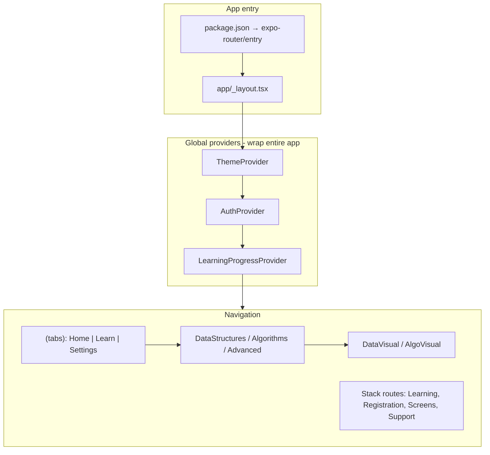
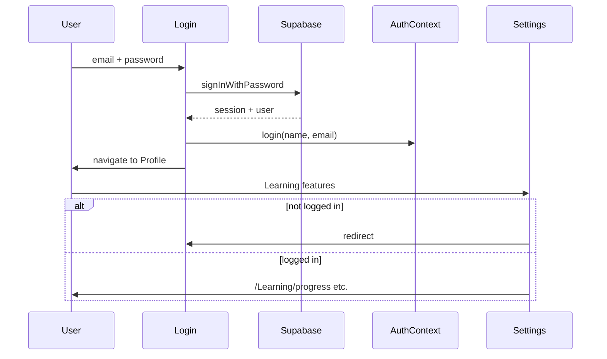
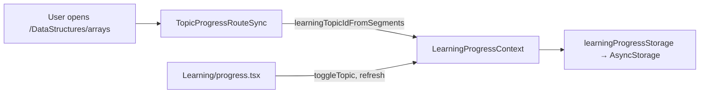

# AlgoTrainer — Project Architecture & Flow

This document describes how **AlgoTrainer** is structured, how navigation and data flow connect, and where the main gaps are today.

---

## High-Level Architecture



The root layout wires three cross-cutting concerns before any screen renders:

**File:** `app/_layout.tsx`

```tsx
<ThemeProvider>
  <AuthProvider>
    <LearningProgressProvider>
      <RootNavigation />
    </LearningProgressProvider>
  </AuthProvider>
</ThemeProvider>
```

---

## 1. Navigation (Expo Router)

Routing is **file-based** under `app/`. The root stack exposes the main “modal” areas; tabs are the day-to-day shell.

| Area | Path pattern | Role |
|------|----------------|------|
| **Tabs** | `/(tabs)/index`, `learn`, `settings` | Main shell (custom tab bar) |
| **Lessons** | `/DataStructures/arrays`, `/Algorithms/sorting`, `/Advanced/recursion`, … | Static lesson content |
| **Visuals** | `/DataVisual/array-visual`, `/AlgoVisual/sorting-visual`, … | Interactive demos from lessons |
| **Auth** | `/Registration/Login`, `Signup` | Supabase sign-in/up |
| **Profile** | `/Screens/Profile`, `Email`, `Password`, `Language` | Account UI |
| **Learning prefs** | `/Learning/difficulty`, `dailygoal`, `progress` | Gated by login in Settings |
| **Support** | `/Support/Help-Center`, `About`, `private-policy` | Help / legal |

### Learn tab → lesson flow

**File:** `app/(tabs)/learn.tsx`

1. User expands a module (Data Structures, Algorithms, Advanced).
2. `selectedTopic()` builds a path like `/DataStructures/arrays` or `/Advanced/dynamic-programming`.
3. That opens the matching screen in `app/DataStructures/`, `Algorithms/`, or `Advanced/`.

### Lesson → visual flow

Example from `app/DataStructures/arrays.tsx`:

- Lesson screen ends with a button → `router.push("/DataVisual/array-visual")`.
- Same pattern for stacks, trees, sorting, searching, etc.

---

## 2. Theme System

**`ThemeContext`** (`app/theme/ThemeContext.tsx`) holds light/dark (and custom) tokens: colors, gradients, category colors (`algorithms`, `dataStructures`, …).

| Consumer | Usage |
|----------|--------|
| Screens | `useContext(ThemeContext)` |
| Typography / spacing | `createTypography(theme)`, `spacingUtils` from `app/theme/` |
| UI components | `Card`, `Expandables` receive `theme` as a prop |
| Navigation | Root layout maps theme into React Navigation `NavThemeProvider` |
| Persistence | `app/utils/ThemeStorage.ts` for theme prefs |

Settings toggles dark mode with `toggleTheme` on the Preferences switch.

---

## 3. Authentication (Two Layers)



| Layer | Where | What it does |
|--------|--------|----------------|
| **Real auth** | `lib/supabase.ts` | `signUp`, `signInWithPassword`, `signOut`, `updateUser` (email/password) |
| **App state** | `AuthContext` | In-memory `isLoggedIn` + `user { name, email }` |

### Connected screens

- **Login** → Supabase success → `login()` → `router.replace('/Screens/Profile')`
- **Signup** → Supabase `signUp` → back to Login
- **Profile** → shows `useAuth()` user; logout calls `supabase.auth.signOut()` + `logout()` → tabs
- **Settings** → gates Difficulty, Daily Goal, Progress behind `isLoggedIn`; shows Login/Signup card when not

### Important gap

`AuthContext` does **not** restore a Supabase session on cold start. After restart, the user may still have a Supabase session on the client, but the UI treats them as logged out until they log in again. Auth is “Supabase for API + React state for UI.”

---

## 4. Learning Progress (Separate from Auth DB)



### Registry

**File:** `lib/learningTopics.ts`

Defines 10 tracked IDs (`arrays`, `linkedlist`, … `searching`) aligned with route segments under `DataStructures/` and `Algorithms/`.

### Auto-complete

**File:** `app/Learning/LearningProgressContext.tsx`

`LearningProgressProvider` mounts `TopicProgressRouteSync`, which watches `usePathname()`. When the path matches a tracked lesson, it calls `markComplete(id)`.

### Persistence

**File:** `lib/learningProgressStorage.ts`

Saves a JSON map to AsyncStorage key `learning_topic_progress_v1` (with in-memory fallback if native AsyncStorage isn’t linked).

### Progress UI

**File:** `app/Learning/progress.tsx`

Reads `useLearningProgress()`, shows % complete, lets users toggle topics manually.

### Not wired yet

- `supabase/migrations/20250515180000_learning_topic_progress.sql` defines a `learning_topic_progress` table for per-user sync, but the app **does not read/write that table** today—progress is device-local only.
- **Advanced topics** (greedy, DP, graph algorithms, recursion) are in the Learn tab but not in `LEARNING_TOPIC_IDS`.

---

## 5. Screen Layers & Shared Components

```
(tabs)
├── index.tsx      → informational cards (no navigation)
├── learn.tsx      → Expandables → lesson routes
└── settings.tsx   → Expandables → Learning / Support / Registration

components/
├── Card/          → Home hero cards, Settings login card
└── Expandable/    → Learn modules + Settings sections

Lesson screens (e.g. arrays.tsx)
├── FlatList of content blocks (text, code, lists)
├── ThemeContext for styling
├── Copy-to-clipboard on code
└── Button → DataVisual/* or AlgoVisual/*
```

- **Home** is marketing-style static modules; it does not deep-link into lessons.
- The real curriculum entry is the **Learn** tab.

---

## 6. Backend / Infra

| Piece | Status |
|--------|--------|
| `lib/supabase.ts` | Client from `EXPO_PUBLIC_SUPABASE_*` env vars |
| Supabase Auth | Used for login, signup, email/password updates |
| Supabase DB migration | Schema ready for progress sync; **app not using it** |
| `supabase/` folder | CLI config, migrations, seed—for local/hosted Supabase |

See also: `supabase/README.md` for CLI setup (`db pull`, `db push`, local `supabase start`).

---

## 7. End-to-End User Journeys

### Browse & learn (no login required)

1. Open app → `(tabs)` default Home.
2. Learn tab → pick topic → lesson screen.
3. Optional: “Visualize” → `DataVisual/*` or `AlgoVisual/*`.
4. Opening a tracked lesson auto-marks progress (AsyncStorage).

### Personalized settings (login required for some items)

1. Settings → Login/Signup if needed.
2. Difficulty / Daily goal / Progress (Progress uses local storage, not Supabase).
3. Profile → edit email/password via Supabase; stats on Profile are still hardcoded placeholders (`'0'`, `'0 min'`).

### Theme

1. Settings → Dark Mode switch → `ThemeContext.toggleTheme()` → entire app + nav chrome update.

---

## 8. How Everything Connects (Summary)

| Concern | Connects via |
|---------|----------------|
| **UI look & feel** | `ThemeContext` → screens + `Card` / `Expandables` + nav theme |
| **Where you go** | Expo Router file paths + `useRouter().push/replace` |
| **Curriculum catalog** | `learn.tsx` module list ↔ folders `DataStructures`, `Algorithms`, `Advanced` |
| **Lesson ↔ visual** | Each lesson’s button → matching `*visual` route |
| **Progress** | Route pathname → `learningTopics` → `LearningProgressContext` → AsyncStorage |
| **Login gate** | `AuthContext.isLoggedIn` in Settings (not on Learn tab) |
| **Account ops** | Supabase auth API; Profile/Email/Password screens |
| **Planned but unused** | Supabase `learning_topic_progress` table for cloud sync |

---

## Mental Model

The app is effectively **three parallel systems**:

1. **Expo Router** — navigation and screen structure  
2. **Supabase** — identity (auth + planned progress table)  
3. **Local AsyncStorage** — learning progress on device  

**AuthContext** bridges Supabase login into UI state only for the current session.

---

## Key File Reference

| Purpose | Path |
|---------|------|
| App entry / providers | `app/_layout.tsx` |
| Tab shell | `app/(tabs)/_layout.tsx` |
| Auth state | `app/auth/AuthContext.tsx` |
| Supabase client | `lib/supabase.ts` |
| Progress context | `app/Learning/LearningProgressContext.tsx` |
| Progress storage | `lib/learningProgressStorage.ts` |
| Topic IDs | `lib/learningTopics.ts` |
| Theme | `app/theme/ThemeContext.tsx` |
| Learn catalog | `app/(tabs)/learn.tsx` |
| Settings & gates | `app/(tabs)/settings.tsx` |

---

*Generated for AlgoTrainer. Update this doc when wiring Supabase progress sync or session restore on launch.*
